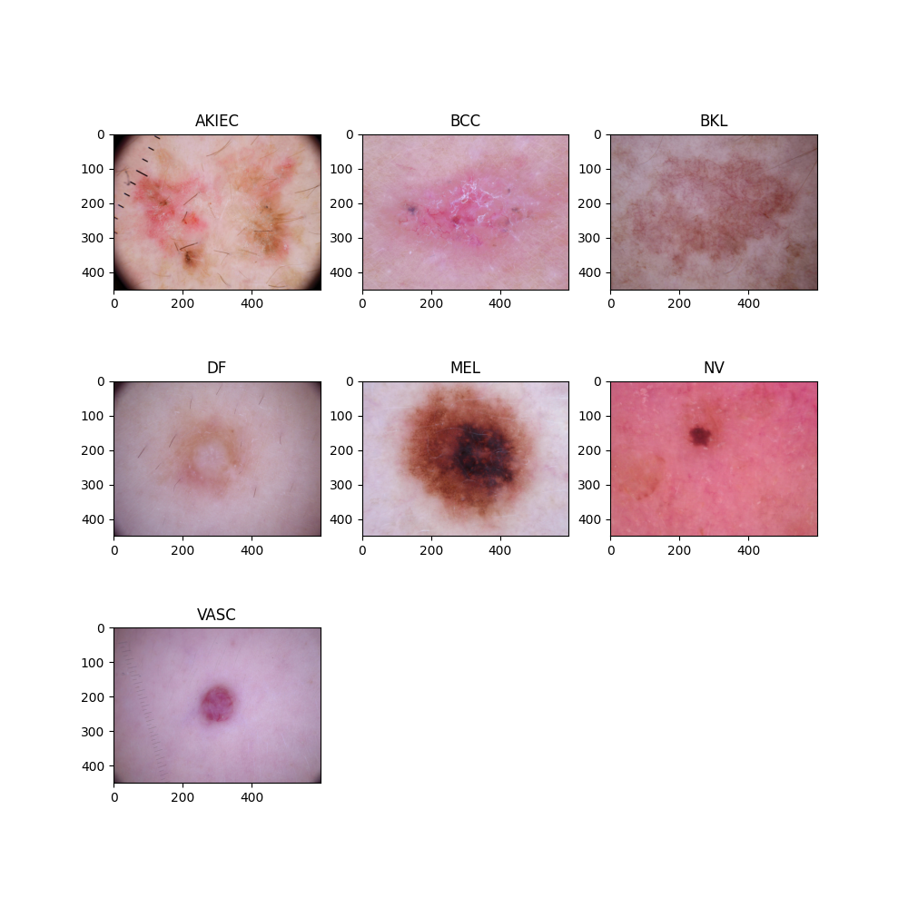
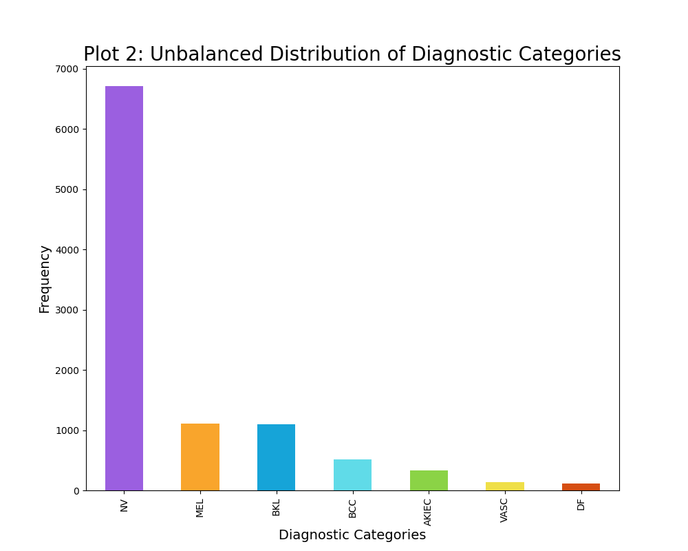
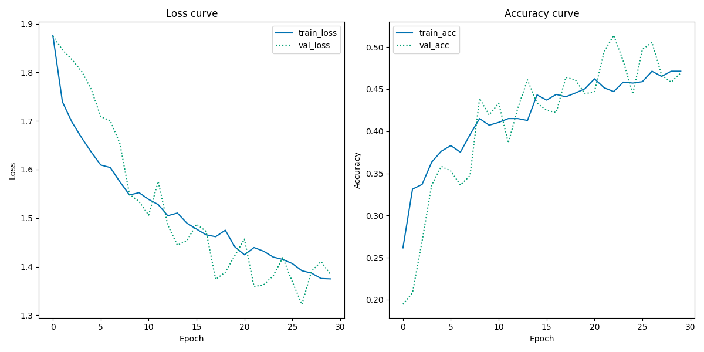
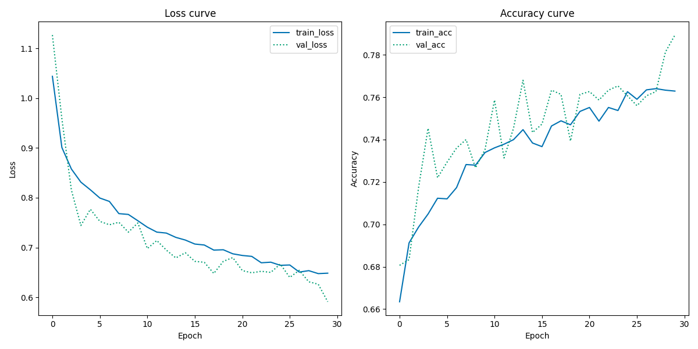

# **Final Project - Skin Cancer Classifier**
## **Cultural Data Science - Visual Analytics** 
#### Author: Rikke Uldbæk (202007501)
#### Date: 8th of May 2023
<br>

## **4.1 GitHub link**

The following link is a link to the GitHub repository of the self assigned final project in the course Visual Analytics (F23.147201U023.A). Within the GitHub repository all necessary code are provided to reproduce the results of the project. 

https://github.com/rikkeuldbaek/SkinCancerClassifier_VA_FP


<br>

# **4.2 Description**

For this final project I have worked with a collection of dermatoscopic images with different categories of pigmented skin lesions, i.e., skin cancer, in order to build a classifier that is able to segment and classify different diagnostic categories of skin cancer. The nature of the data is quite unbalanced, hence two identical classifiers have been designed to classify a *balanced* dataset of skin cancer and an *unbalanced* dataset of skin cancer. The performance of the two identical classifiers is evaluated in order to review the impact of varying data distributions.
This repository contains source code which train two identical *pretrained CNN* on the skin cancer dataset (*the HAM10000 dataset*), classifies the diagnostic categories of skin cancer and produce a classification reports and a training/validation history plots.


<br>


# **4.3 Data**
For this final project I have used the *HAM10000 dataset* ("Human Against Machine with 10000 training images"). This dataset contains 10015 multi-source dermatoscopic images of common pigmented skin lesions, also known as skin cancer. This collection of images of skin cancer includes seven representative diagnostic categories within the domain of pigmented lessions. These seven categories are: Actinic keratoses and intraepithelial carcinoma / Bowen's disease (AKIEC), basal cell carcinoma (BCC), benign keratosis-like lesions (solar lentigines / seborrheic keratoses and lichen-planus like keratoses, BKL), dermatofibroma (df), melanoma (MEL), melanocytic nevi (NV) and vascular lesions (angiomas, angiokeratomas, pyogenic granulomas and hemorrhage, VASC) (Tschandl, 2018). Furthermore, the *HAM10000 dataset* consists of a *Ground Truth* .csv file matching each image filename to its diagnostic category. The plot below illustrates each of the seven diagnostic categories of skin cancer.

**Plot 1: Diagnostic Categories of Skin Cancer**



The distribution of the diagnostic categories of skin cancer was intitially rather unbalanced, as seen from plot 1. For instance the unbalanced data contained 6705 images of the diagnostic category *NV*, while containing 115 images of the diagnostic category *DF*. Thus, a maximum limit of 500 samples per diagnostic category was established, although some categories had less than 500 data points. This resulted in a slightly more balanced dataset, however it is not completely balanced out as visually evident from plot 2. Furthermore, this maximum limit of 500 samples per diagnostic category decreased the sample size substantially from 10015 images to 2584 images. This decrease in sample size have a great impact on the modelling, thus I have created two classifiers: one of which trains on the unbalaned data (10015 data points) and one of which trains on the balanced data (2584 data points). The varying results will be discussed in the result section. 

|||
|---|---|
|||


<br>


# **4.4 Repository Structure**
The scripts of this project require a certain folder structure, thus the table below presents the required folders and their description and content.

|Folder name|Description|Content|
|---|---|---|
|```data```|images of skin cancer and .csv file with labels|```archive/images/all_images```,```archive/GroundTruth.csv```|
|```src```|model, data, and plot scripts|```data.py```, ```classifier_balanced.py```, ```classifier_unbalanced.py```, ```plot.py```, ```unzip_data.py```|
|```out```|classification reports and training/validation history plot|```classification_report_balanced.txt```,```classification_report_unbalanced.txt```, ```train_val_history_plot_balanced.png```, ```train_val_history_plot_unbalanced.png```|
|```readme_pngs```|plots for the readme file|```balanced_distribution.png```, ```unbalanced_distribution.png```, ```diagnostic_categories.png```|
|```utils```|helper functions|```helper_func.py```|

The ```unzip_data.py``` script located in ```src``` unzips the data into the ```data```folder. The ```data.py``` script located in ```src``` preprocesses the data and produces training, test, and validation data for both balanced and unbalanced data. The ```classifier_balanced.py``` and ```classifier_unbalanced.py``` scripts located in ```src``` produce skin cancer classifier models trained on balanced and unbalanced data, furthermore they produce classification reports and a training/validation history plots which are saved in the folder ```out```. Helper functions for plotting are found in the folder ```utils``` and relevant plots for illustrations are found in the folder ```readme_pngs```. 


<br>

# **4.5 Usage and Reproducibility**
## **4.5.1 Prerequsities** 
In order for the user to be able to run the code, please make sure to have bash and python 3 installed on the used device. The code has been written and tested with Python 3.9.2 on a Linux operating system. In order to run the provided code for this assignment, please follow the instructions below.

<br>

## **4.5.2 Setup Instructions** 
**1) Clone the repository**
Please execute the following command in the terminal to clone this repository. 
```python
git clone https://github.com/rikkeuldbaek/SkinCancerClassifier_VA_FP.git
 ```

 **2) Setup** <br>
Please execute the following command in the terminal to setup a virtual environment (```VA_fp_env```) and install packages.
```python
bash setup.sh
```
<br>

**3) Download the data and unzip the file** <br>
Please download the *HAM10000 dataset* from Kaggle ([HAM10000 dataset](https://www.kaggle.com/datasets/surajghuwalewala/ham1000-segmentation-and-classification)
), and store the ```archive.zip``` zipfile in the ```data``` folder in this repository. Please run the following script in order to unzip file into the ```data``` folder. The command must be executed in the terminal. This may take a few minutes since the files in the zipfile are around 3GB in total. 

```python
python src/unzip_data.py 
```

<br>

## **4.5.3 Running the scripts** 
Please execute the following command in the terminal to automatically run the ```data.py```, ```classifier_balanced.py```, and```classifier_unbalanced.py``` scripts.
```python
bash run.sh
```


## **4.5.4 Script arguments**
The skin cancer classifier have the following default arguments stated in the table below. These arguments can be modified and adjusted in the ```run.sh``` script. If no modifications are added, default parameters are run. In case help is needed, please write ```--help``` in continuation of the code below instead of writing an argument.

```python
python src/classifier.py #add arguments here or --help
```

<br>

Both ```classifier_balanced.py``` and ```classifier_unbalanced.py``` take the following arguments:
|Argument|Type|Default|
|---|---|---|
|--target_size|int|(224,224)|
|--horizontal_flip|bool| True|
|--vertical_flip|bool|True |
|--zca_whitening|bool|True |
|--shear_range|float|0.2 |
|--zoom_range|float|0.2 |
|--rotation_range|int|20 |
|--rescale_1|float|1. |
|--rescale_2|float|225. |
|--batch_size|int|30 |
|--n_epochs|int|30 |
|--class_mode|str|categorical |
|--pooling|str| avg|
|--input_shape|int|(224,224,3)|
|--monitor|str|val_loss |
|--patience|int|5 |
|--restore_best_weights|bool|True |
|--nodes_layer_1|int| 300|
|--nodes_layer_2|int| 150|
|--activation_hidden_layer|str|relu |
|--activation_output_layer|str| softmax|
|--initial_learning_rate|float| 0.01 |
|--decay_steps|int| 10000|
|--decay_rate|float|0.9 |
|--loss|str|categorical_crossentropy |


<br>

The ```data.py``` takes the following arguments:
|Argument|Type|Default|
|---|---|---|
|--train_split_bal|float|.70|
|--val_split_bal|float|.15|
|--train_split_ubal|float|.70|
|--val_split_ubal|float|.15|


<br>

### **Important to note** <br>
The target_size and the input_shape argument must be specified _without_ commas in the ```run.sh``` script, please see following command for an example of such:

```python
python src/classifier.py --target_size  224 224 --input_shape 224 224 3
 ```

Similarly it is very important to note that the ```data.py``` is automatically called upon when running both classifier scripts, thus the arguments for ```data.py``` must be parsed to the ```classifier_balanced.py``` and ```classifier_unbalanced.py``` script in ```run.sh```:

````python 
python src/classifier_balanced.py --classifier_arguments --data_arguments
python src/classifier_unbalanced.py --classifier_arguments --data_arguments
````


# **4.6 Results**

## **4.6.1 Results of the skin cancer classifier using balanced data**

**[Classification report](out/classification_report_balanced.txt)** (open link to see) <br>
The model shows an accuracy of 49%. Furthermore, the model seems to be best at classifying *NV*, *MEL*, and *BCC* with F1 scores of 63%, 55%, 51% respectively. This makes sense, as the model sees more images of these three diagnostic categories, and thus the model become more exposed to learning them. The model seems to be worst at classifying *DF*, *BKL*, *AKIEC*, *VASC* with F1 scores of 0%, 30%, 45% and 48% respectively. This also makes sense, as the model is exposed to fewer images of these diagnostic categories. However it is not the case of *BKL*. *BKL* actually have almost as many images in the test data as the best predicted diagnostic categories, but it only gains an F1 score of 30%. 
The reason for this may be that the features of *BKL* are not that salient and may resemble other types of skin cancer, and thus becomes harder to classify (see plot 1 of diagnostic categories). It is also evident from the precision and recall score that the skin cancer classifier has a high number of false positives and false negatives, which may be caused by a yet not totally balanced dataset. 


**Training and validation history plot**



From the Loss Curve plot, the validation loss looks very noisy while the training loss looks decent, indicating a unrepresentative validation dataset. Furthermore, the validation loss curve is mainly below the training loss curve towards the end, suggesting that the model finds it easier to predict the validation dataset than the training dataset. 

From the Accuracy Curve plot, similar noisy tendencies in the validation accuracy are present. However, the training accuracy curve seems to have reached a point of stability where no more new knowledge is acquired. Overall, the performance of the model is not ideal, as it looks like it performs better on unseen data than seen data, which makes very little sense. 

<br>

## **4.6.2 Results of the skin cancer classifier using unbalanced data**


**[Classification report](out/classification_report_unbalanced.txt)** (open link to see) <br>
The model shows an accuracy of 76%. Furthermore, the model seems to be best at classifying *blouses*, *nehru jackets*, *lehenga*, and *mojaris for men* with F1 scores of 90%, 85%, 84%, 84% respectively. 


**Training and validation history plot**




<br>

## **Resources**
[HAM10000 dataset](https://www.kaggle.com/datasets/surajghuwalewala/ham1000-segmentation-and-classification)


Tschandl, P. (2018). The HAM10000 dataset, a large collection of multi-source dermatoscopic images of common pigmented skin lesions (ViDIR Group, Ed.; V4 ed.). Harvard Dataverse. https://doi.org/10.7910/DVN/DBW86T